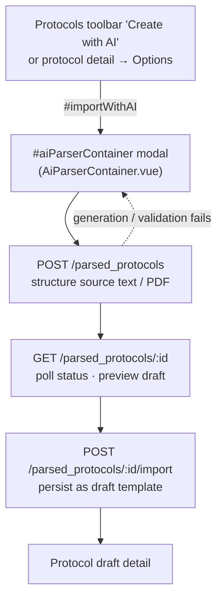
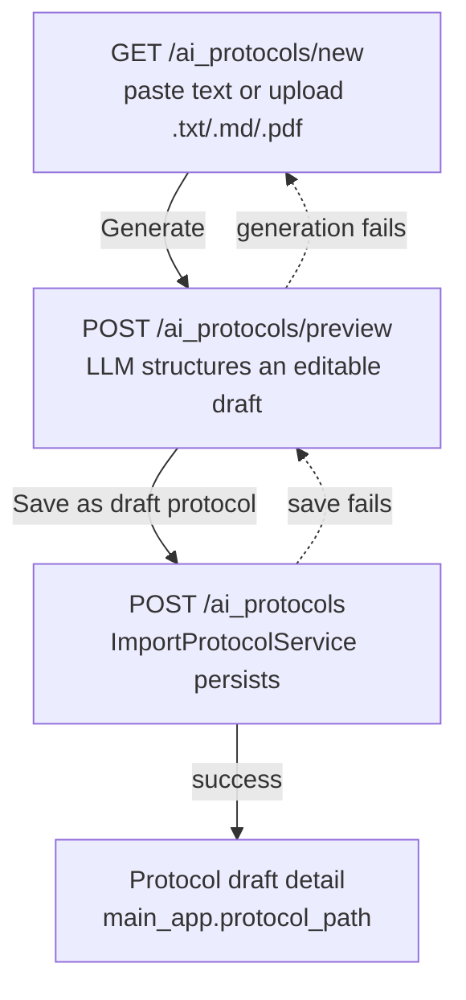

# scinote_ai_protocols

SciNote addon that generates structured **protocol templates** from free text or
PDF/SOP via an OpenAI-compatible LLM (Create with AI / Import with AI).

Implemented as a Rails Engine (`Scinote::AiProtocols::Engine`) so that **no core
`app/` files are modified** — see `docs/development/addon-dev-workflow.md`.

## Activation

The addon reuses the host's existing AI feature flag:

- `ApplicationSettings#values['ai_protocol_parser_enabled']` must be `true`
  (set by the `EnableFeatureFlags` migration in the host app), AND
- `AI_PROTOCOLS_PARSER` (base URL) must be set.

## Required environment variables

| Variable | Purpose | Default |
|---|---|---|
| `AI_PROTOCOLS_PARSER` | OpenAI-compatible base URL (e.g. `https://api.openai.com/v1` or an Azure endpoint) | — (required) |
| `AI_PROTOCOLS_API_KEY` | Bearer token for the endpoint | — (optional for some self-hosted) |
| `AI_PROTOCOLS_MODEL` | Model name | `gpt-4o-mini` |

## Usage

The addon renders an **in-page modal** (the official shape) and is reachable
**only** from the native AI entries that already ship in core. The addon does
**not** inject a button of its own:

| Where | Native source | How it opens the modal |
|---|---|---|
| Protocols library (`/protocols`), top toolbar | `app/javascript/vue/protocols/table.vue` (`name: 'import_ai'`, `btn btn-rainbow`) | emits `import_ai` → `document.querySelector('#importWithAI').click()` |
| Protocol detail page, **Options** dropdown | `app/javascript/vue/protocol/protocolOptions.vue` | same `#importWithAI` trigger |

The hidden `#importWithAI` trigger **and** the modal are rendered by the addon's
`AiParserContainer.vue`, mounted at `#aiParserContainer`, which is injected into
`div.sci--layout-content` of **both** `layouts/application` and `layouts/fluid`
(protocol pages use `fluid`) by
`app/overrides/ai_protocol_parser_container.rb`.

> ⚠️ **History / why there is only one button.** Until 2026-10-09 the addon
> *also* deface-injected its own blue `Create with AI` into `div.title-row`
> (`id="createProtocolWithAi"`, linking to the legacy `/ai_protocols/new` page).
> That produced a **duplicate** entry the official product does not have, so it
> was removed. `test/protocol_library_entry_test.rb` fails if it ever returns.

### Primary flow (modal — official shape)



### Legacy flow (no-JS fallback — reachable by URL only)

Nothing links to it any more; it is kept as a server-rendered fallback:



The wizard pages (`new.html.erb` / `preview.html.erb`) live entirely inside the
engine: title "Create Protocol with AI", a large source-text textarea, a file
picker (`.txt/.text/.md/.markdown/.pdf`), then an editable preview (protocol
name, description, per-step name/description plus per-step tables) that persists
as a **draft protocol template** (`protocol_type: :in_repository_draft`) through
the host `ProtocolImporters::ImportProtocolService`.

### Visibility & access control

The modal is only usable when `Protocol.ai_parser_enabled?` is true (feature flag
+ `AI_PROTOCOLS_PARSER` env). Hitting the endpoints directly is blocked too:
`ProtocolGeneratorController` runs `before_action :check_ai_parser_enabled` and
`before_action :check_generate_permission` (the latter delegates to the host
`can_create_protocols_in_repository?`), both of which `render_403`.

### Notes

- PDF text is extracted with `pdftotext` (poppler-utils). The host already
  depends on it for full-text search; ensure it is installed in your image.
- The generated protocol is a **draft template for review**, not an auto-import
  into a project — edit and import it through the normal SciNote flow.

## Tests

`test/` holds **minitest** guardrails, run with:

```bash
./run_ai_protocols_tests.sh          # from F:/eln开发
```

`test/protocol_library_entry_test.rb` locks the entry-point contract: the addon
must inject the `#aiParserContainer` mount point, must **not** inject its own
entry button, and the native entry chain must still exist upstream.

> ⚠️ The `spec/` directory is legacy **RSpec** and does not run in the container we
> verify against: the image sets `BUNDLE_WITHOUT: "development:test"`, so there is
> no `rspec` executable there (`bundle exec rspec` → `command not found`; boot logs
> `[SciNote] Unable to load specs from addons!`). New guardrails go into `test/`
> (minitest), matching the `access_control` / `eln_ui` / `workbench` addons.

## Architecture

- `app/javascript/vue/AiParserContainer.vue` — root component: hidden
  `#importWithAI` trigger + modal / paywall switch (`showModal`).
- `app/javascript/vue/AIImportModal.vue` — the modal itself (prompt-only or file
  upload → generate → preview → create template).
- `app/overrides/ai_protocol_parser_container.rb` — injects the mount point and
  the compiled pack into `layouts/application` and `layouts/fluid`.
  **Never `.squish` this heredoc** — see the comment block in the file.
- `app/controllers/.../protocol_generator_controller.rb` — JSON API backing the
  modal (`create` / `show` / `import` / `remaining_count`) and the legacy wizard.
- `lib/scinote/ai_protocols/llm_client.rb` — thin, mockable OpenAI-compatible
  client (retries transient 5xx / network errors; surfaces 4xx as `ApiError`).
- `app/services/scinote/ai_protocols/protocol_generator.rb` — turns LLM JSON into
  the `ProtocolImporters::ImportProtocolService` `steps_params` schema
  (falls back to a heuristic draft when the LLM is unavailable).
- `app/services/scinote/ai_protocols/text_extractor.rb` — reads `.txt/.md`
  directly and extracts `.pdf` text via `pdftotext`.

See `docs/开发计划/ai-eln/实现现状与开发计划.md` for the full PRD / issue breakdown.
