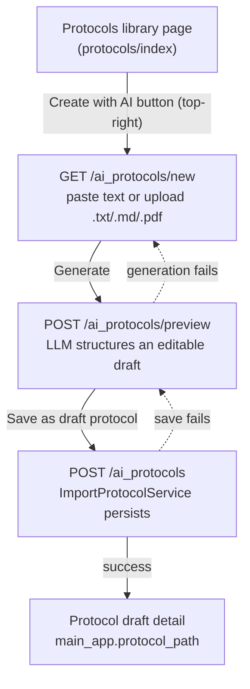

# scinote_ai_protocols

SciNote addon that generates structured **protocol templates** from free text or
PDF/SOP via an OpenAI-compatible LLM (Create with AI / Import with AI).

Implemented as a Rails Engine (`Scinote::AiProtocols::Engine`) so that **no core
`app/` files are modified** — see `docs/development/addon-dev-workflow.md`.

## Activation

The addon reuses the host's existing AI feature flag:

- `ApplicationSettings#values['ai_protocol_parser_enabled']` must be `true`
  (set by the `EnableFeatureFlags` migration in the host app), AND
- `AI_PROTOCOLS_PARSER` (base URL) must be set.

## Required environment variables

| Variable | Purpose | Default |
|---|---|---|
| `AI_PROTOCOLS_PARSER` | OpenAI-compatible base URL (e.g. `https://api.openai.com/v1` or an Azure endpoint) | — (required) |
| `AI_PROTOCOLS_API_KEY` | Bearer token for the endpoint | — (optional for some self-hosted) |
| `AI_PROTOCOLS_MODEL` | Model name | `gpt-4o-mini` |

## Usage

The addon surfaces as a **self-contained three-step flow** reachable from the
host Protocols library page. No core `app/` views are touched — the entry
button is injected by deface and the wizard pages live entirely inside the
engine.

### Flow

### Step-by-step

1. **Entry button** — On the Protocols library page a blue
   `Create with AI` button (`id="createProtocolWithAi"`, top-right of the
   title row) is injected by `app/overrides/ai_protocol_create_button.rb`.
   It links to `/ai_protocols/new`.
2. **Input page** (`new.html.erb`) — Title "Create Protocol with AI", a large
   source-text textarea, and a file picker (`.txt/.text/.md/.markdown/.pdf`).
   Press **Generate**.
3. **Preview / edit page** (`preview.html.erb`) — The LLM output is rendered as
   an editable form: protocol name, description, and per-step name/description
   plus per-step tables (name + JSON 2-D array). Press **Save as draft protocol**.
   If generation fails, a flash alert is shown and you return to the input page.
4. **Persist** (`create`) — The result is saved as a **draft protocol template**
   (`protocol_type: :in_repository_draft`) via the host
   `ProtocolImporters::ImportProtocolService`. On success you are redirected to
   the protocol detail page; on failure you return to the preview with an error.

### Visibility & access control

The entry button renders **only when both** conditions hold:

- `Protocol.ai_parser_enabled?` is true (feature flag + `AI_PROTOCOLS_PARSER`
  env), **and**
- `can_generate_protocol_with_ai?(current_user, current_team)` is true (delegates
  to `can_create_protocols_in_repository?`).

If either fails the button is hidden. Hitting the URLs directly is also blocked:
`ProtocolGeneratorController` runs `before_action :check_ai_parser_enabled` and
`before_action :check_generate_permission`, both of which `render_403`.

### Notes

- PDF text is extracted with `pdftotext` (poppler-utils). The host already
  depends on it for full-text search; ensure it is installed in your image.
- The generated protocol is a **draft template for review**, not an auto-import
  into a project — edit and import it through the normal SciNote flow.

## Architecture

- `lib/scinote/ai_protocols/llm_client.rb` — thin, mockable OpenAI-compatible client
  (retries transient 5xx / network errors; surfaces 4xx as `ApiError`).
- `app/services/scinote/ai_protocols/protocol_generator.rb` — turns LLM JSON into the
  `ProtocolImporters::ImportProtocolService` `steps_params` schema.
- `app/services/scinote/ai_protocols/text_extractor.rb` — reads `.txt/.md` directly and
  extracts `.pdf` text via `pdftotext`.
- Generated protocols land as **draft protocol templates** for review before import.

See `docs/开发计划/ai-eln/实现现状与开发计划.md` for the full PRD / issue breakdown.