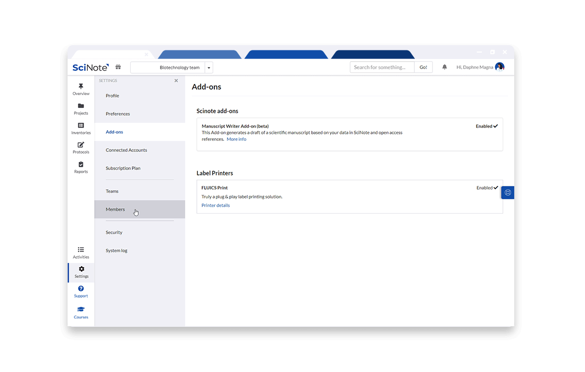
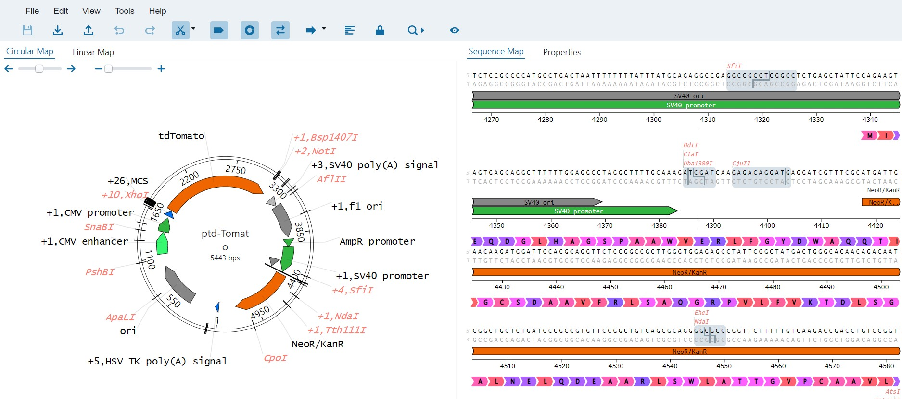
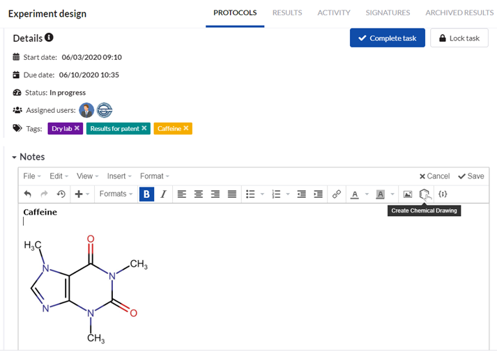
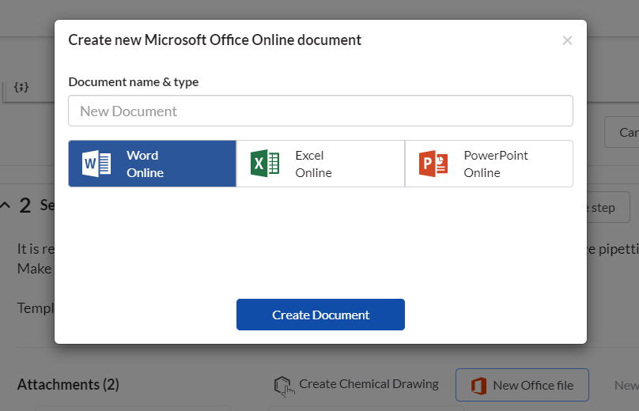
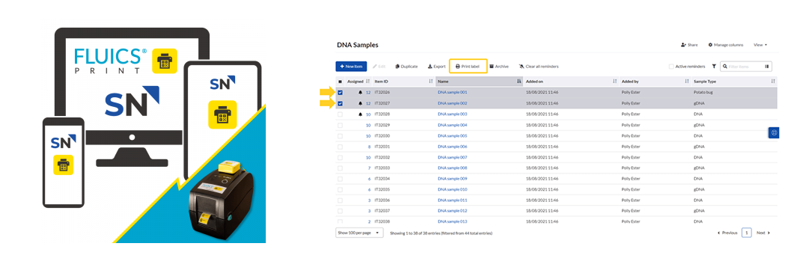
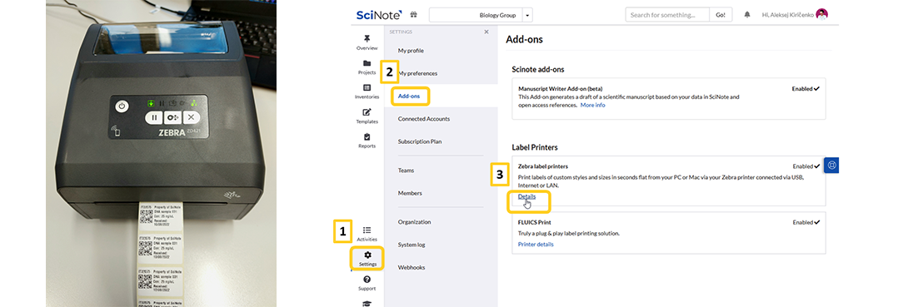
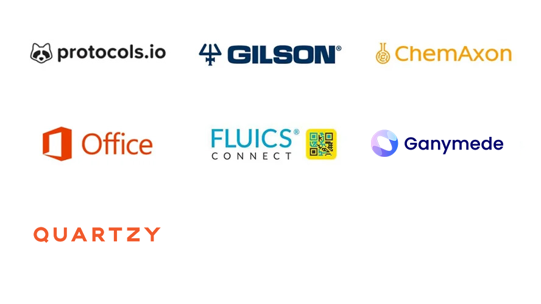

# SciNote 集成与 API（Integrations & API）特性总结

> 来源页面：<https://www.scinote.net/product/integrations-and-api/>
> 整理日期：2026-09-01
> 用途：把官网「集成与 API」营销页的结构化内容沉淀为可离线阅读的文档，作为本 fork 实现现状比对的基线。

---

## 一、概述

SciNote 通过 **RESTful API** 与开箱即用的**合作伙伴集成**，把 ELN 连接到 LIMS、IoT 平台、仪器与其它实验软件，目标是提升实验室的生产力与数字化效率。官方将「集成」定义为把数据、工具、应用、API、仪器连接起来的行为——典型场景包括：链接 LIMS 样本、从仪器拉取数据、把报告回传 LIMS、从外部协议库导入协议、在 SciNote 内编辑 Office 文档、绘制并保存化学结构、通过供应商订购试剂耗材等。

---

## 二、SciNote API

SciNote 提供 **RESTful API**，第三方应用（LIMS、数据管理系统、CRM、ERP）可借此读写 SciNote 数据。数据流可单向或双向：

- 创建 **task（任务）**、**protocol（协议）**、**sample（样本）**
- 更新 SciNote 中的样本
- 接收数据文件（如 result file）

> 用户引语（Program Leader, Advanced Cellular Dynamics）：用 API 做客户端库存导出，定期或在请求时提供计费项目快照，避免手工导出 Excel。

API 在本 fork 中已有完整实现（见 `app/controllers/api/v1`、`app/controllers/api/v2`，含 `tasks_controller`、`protocols_controller`、`inventories_controller`、`results_controller` 等 60+ 控制器），并有独立的对外 API 文档工程 `scinote-api-docs/`。

---

## 三、已列出的集成（官方）

### 3.1 Ganymede — 仪器 / 应用全连接
与 Ganymede.bio 合作，连接实验室内全部仪器与软件，获得数据的统一实时视图，保障数据完整性与可追溯性，加速 R&D、合规、分析与决策。

### 3.2 Quartzy — 库存管理
连接 Quartzy 库存，在 SciNote 内追踪 Quartzy 库存项；可在协议 / 任务中分配库存项或用智能注解引用，实现「库存 → 实验」的可追溯性。库存管理与试剂再订货「即将推出」。

### 3.3 Open Vector Editor (OVE) — 序列编辑器
内置于 Task Protocol step 的开源（MIT）序列编辑器（Teselagen 开发），可直接创建 / 编辑 / 查看质粒与 DNA 序列设计，并支持团队成员协作。

### 3.4 Protocols.io — 外部协议库
从 SciNote 协议库直接搜索 protocols.io 公共数据库、预览并一键导入，系统负责把 protocols.io 协议解析为 SciNote 协议格式。

### 3.5 Gilson Connect — 移液记录
通过平板端 TRACKMAN Connected app（蓝牙连接 PIPETMAN® M Connected 移液器）把移液记录保存到 SciNote。

### 3.6 ChemAxon Marvin — 化学结构
点击 Marvin 按钮即可绘制 / 编辑化学结构并保存回 SciNote，数据始终留在 SciNote 内。

### 3.7 Office for the Web — 在线 Office
在浏览器中用 Office on the web 创建 / 编辑 Excel、Word、PowerPoint，编辑完成后安全存回 SciNote，文件不离开 SciNote。

### 3.8 FLUICS Print — 云标签打印
通过云端打印防污冷冻标签（带二维码）；扫码可直接访问样本属性并全程追踪。

### 3.9 Zebra Label Printers — Zebra 标签打印机
通过 Zebra Browser Print 应用支持 Zebra 标签打印，可用 ZebraDesigner Essentials/Professional 等工具设计标签模板。

### 3.10 Gilson / 其它（页面罗列总览）

---

## 四、角色与用例

| 角色 | 典型用例 |
|---|---|
| Program Leader | 用 API 做客户端库存导出 / 计费快照 |
| org admin | 按知识库步骤连接 Quartzy 等云集成 |
| SciNote team members | 在 OVE 上协作序列设计 |
| 第三方开发者 / 集成方 | 通过 RESTful API 对接 SciNote |
| 终端用户（个人 / Premium / 实验人员） | 直接使用各集成功能 |
| IT / 决策层 | 利用 Ganymede 加速合规与决策 |

---

## 五、如何集成

- **开箱即用集成**：直接使用 SciNote 已提供的合作伙伴集成。
- **RESTful API**：大多数集成依赖 RESTful API。
- **自定义集成**：若目标工具不在合作伙伴列表，或需通过 SciNote API 集成，联系 SciNote（premium@scinote.net）。

---

## 六、本地图片索引

| 文件 | 对应内容 |
|---|---|
| `images/Solutions_1100x700_Integrations_API.png` | 集成与 API 总览 Hero |
| `images/SciNote_API_1000x400_2023-1-1.png` | SciNote API 区块图 |
| `images/SciNote-integrations-March2024.png` | 2024 年集成全景图 |
| `images/Sequence-editor-screenshot-for-release-notes.jpg` | OVE 序列编辑器截图 |
| `images/chemaxon-integration.png` | ChemAxon Marvin 集成 |
| `images/MSoffice-integration.png` | Office for the Web 集成 |
| `images/FLUICSPrint-integrationv2-1078x369-1.png` | FLUICS 云标签打印 |
| `images/ZebraPrint-integrationv3-1078x369-1.png` | Zebra 标签打印 |
| `images/gilson-integration-1030x575.png` | Gilson Connect 集成 |

> 说明：社交图标（Facebook/LinkedIn 等）、favicon、用户头像类图片已剔除，仅保留功能相关截图。
