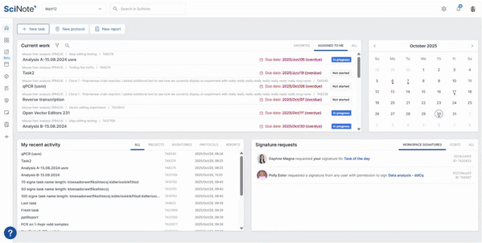
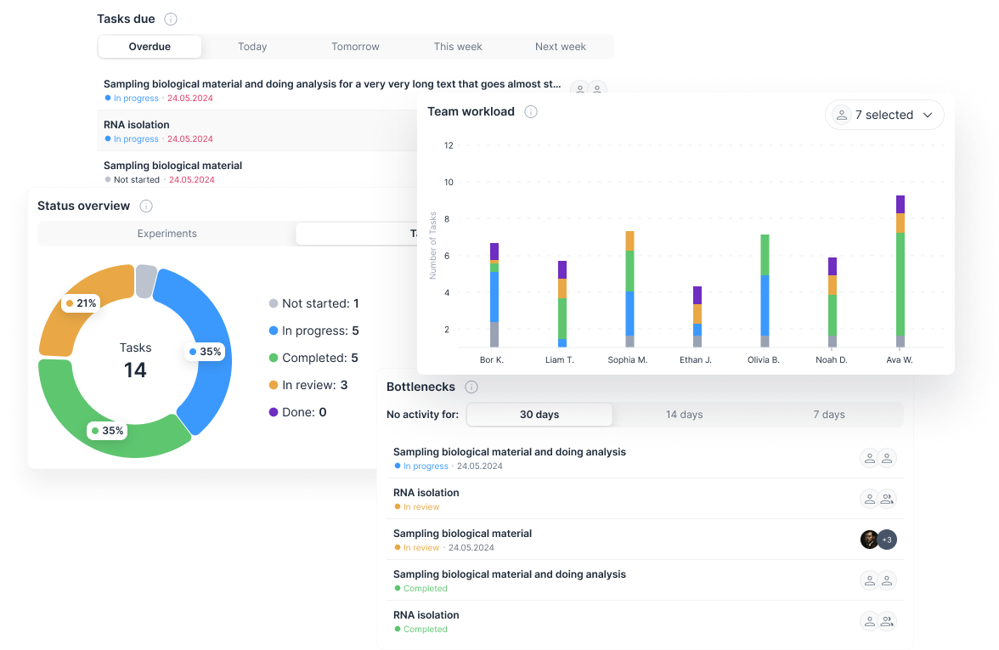
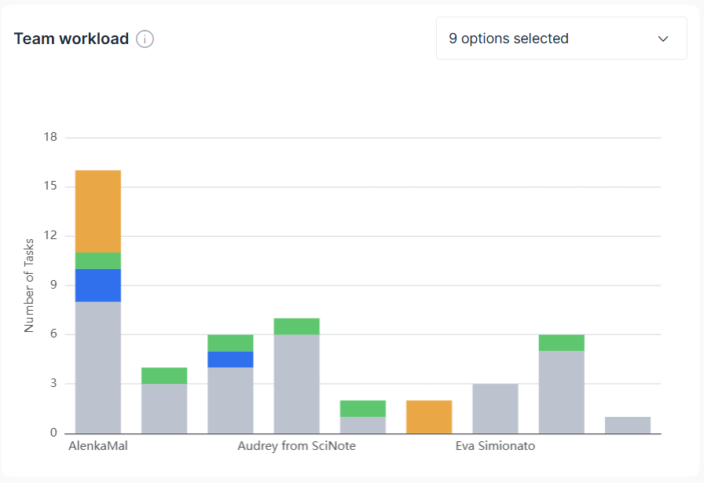
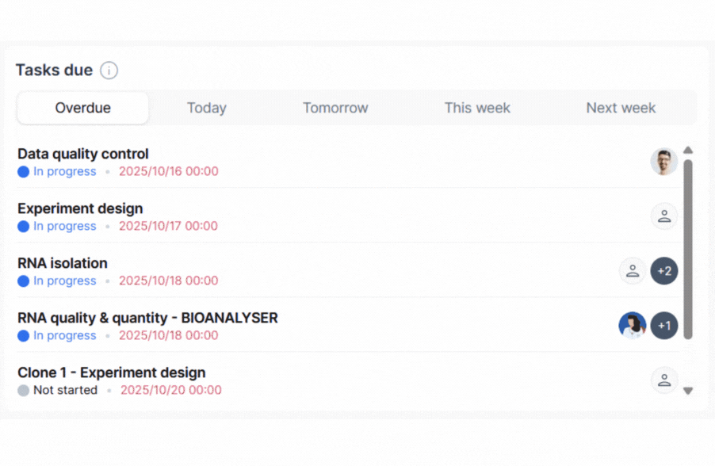

# SciNote 科学项目管理（Project Insights）特性整理

> 来源网页：<https://www.scinote.net/product/scientific-project-management/>
> 整理时间：2026-09-01
> 说明：本文档为官网「Scientific Project Management Dashboard / Project Insights」产品页的内容提炼，并附网页关键截图（见 `images/` 目录）。配套文档见《实现现状与开发计划.md》。

---

## 1. 概述

**Project Insights** 是 SciNote 内置的一块**科学项目管理仪表盘（Dashboard）**，通过多个可自由勾选的 Widget，把项目数据汇成一张统一的概览视图，提供**实时的项目可见性（real-time project visibility）**。

它让团队在同一处看到：任务进度、物料消耗、截止日期、工作负载与瓶颈，从而判断「什么在推进、什么被卡住、团队下一步需要在哪里补位」。

- 直接从 SciNote 侧边栏进入；
- 对所有拥有**项目级访问权限（project-level access）**的角色开放；
- 面向科研、诊断与受监管（regulated）环境设计；
- 当前以 **Premium / Beta** 形态提供（官网引导「Request Access to Project Insights (Beta)」）。

---

## 2. 四个交互式 Widget

Project Insights 通过以下四个交互式 Widget 把项目数据转化为可执行的洞察：

### 2.1 Task & Experiment Status Overview（任务与实验状态概览）
- 用直观的**饼图**展示所有任务 / 实验的当前状态分布。

### 2.2 Team Workload Distribution（团队工作负载分布）
- 用**柱状图**展示任务在团队成员之间的分配情况。
- 

### 2.3 Bottleneck Detection / Inactivity Lags（瓶颈检测 / 停滞识别）
- 识别 **7 / 14 / 30+ 天** 未更新的任务，在进度停滞前定位延迟。
- 点击任意分区可打开**已过滤的任务列表**；在权限允许下可直接编辑任务。

### 2.4 Due Date & Deadline Tracking（截止日期跟踪）
- 一目了然地看到哪些任务**已逾期（overdue）/ 今天到期 / 本周到期 / 即将到来**。
- 

> 交互共性：点击任意区块 → 打开经过滤的任务列表；有权限时可直接编辑任务。

---

## 3. 面向科学团队的更智能项目管理

Project Insights 带来的核心能力：
- 实时掌握项目健康度；
- 跟踪逾期任务、受阻工作流或延迟；
- 平衡团队工作负载、调整任务指派；
- 借助智能过滤快速下钻到任务级视图；
- 提升 QA / 审计所需的文档就绪度。

---

## 4. 为团队中每一个角色而建（BUILT FOR EVERY ROLE）

| 角色 | 关注点 |
| --- | --- |
| **Lab Managers（实验室经理）** | 监控多条工作流与并行实验 |
| **Project Leads & Coordinators（项目负责人 / 协调人）** | 规划时间线、资源与里程碑 |
| **QA / Compliance Personnel（QA / 合规人员）** | 核验文档与完成情况 |
| **Principal Investigators / PIs（首席研究员）** | 跨协作项目监督进展 |

---

## 5. 真实世界用例（REAL-WORLD USE CASES）

### 5.1 Pharmaceutical R&D Teams（制药研发团队）
- 监控稳定性研究（stability studies）与分析检测状态；
- 跟踪逾期的协议步骤（如「QA review of batch record」）；
- 识别长期未更新的任务（如协议版本化延迟）；
- 依据团队负载或变更的里程碑重新指派任务；
- 支撑合规驱动工作流（如 IND 时间线跟踪、GxP 就绪），对复杂实验流程中未完成 / 闲置的任务提供可见性。

### 5.2 Diagnostic Laboratories（诊断实验室）
- 快速识别落后中的诊断工作流（如 PCR、ELISA、NGS）；
- 按阶段监控任务状态（如 Sample Extraction → Result Review）；
- 把逾期 / 闲置任务重新指派给负载较低的技师；
- 为保证质控，确保所有任务都被指派且设有截止日期。

### 5.3 Contract Research Organizations / CROs（合同研究组织）
- 概览跨赞助方 / 研究项目的任务推进情况；
- 跟踪与特定里程碑绑定的交付物（如客户数据评审）；
- 在团队层面识别瓶颈或资源约束；
- 为赞助方汇报或内部会议快速查看 / 分享过滤后的任务列表。

---

## 6. 合规与可用性

- 面向运行在 **GxP、GLP 或 ISO** 合规框架下的团队设计；
- 覆盖从受监管环境、诊断实验室到高吞吐合同研究的广泛科研工作流。

---

## 7. 用户评价（节选）

- **Valinda J.**（企业级研究助理）——「Effortless Project Tracking」
  > 轻松跟踪不同项目，组织清晰、可快速检索；喜爱能引用其他笔记作为参考，每天使用并向其他研究者演示。
- **Niclas F.**（小型企业靶点验证科学家）——「Modern electronic lab book with good project management」
  > UI 美观易用、随时给出清晰概览；项目可轻松搭建、管理与分发，客户支持响应及时。
- **ELOY C.**（小型企业环境工程与生物技术）——「Is an efficient way to manage projects and their activities.」
  > 赞赏能管理并编排研究协议及其模板。

---

## 8. 获取方式（官网现状）

- 已使用 SciNote Premium：可在知识库文章查看访问权限，或联系客户成功经理；
- 尚不符合资格但想试用：可「Request Access to Project Insights (Beta)」。

---

## 9. 图片索引（本地副本）

| 文件 | 内容 |
| --- | --- |
| `images/Project-insights.gif` | 仪表盘总览动图（hero） |
| `images/Insights-widgets-collage.png` | 四个 Widget 拼图 |
| `images/Insights-Team-workload-widget2.png` | 团队工作负载 Widget |
| `images/Task-Due.gif` | 截止日期跟踪 Widget |
| `images/Untitled-design.gif` | 状态 / 瓶颈相关动图 |
| `images/thumb_square_60433191336e4747c246b4a892ce50b3.webp` | 缩略截图 |

> 配套分析：本 fork（scinote-web OSS）实现现状与缺失功能开发计划，见《实现现状与开发计划.md》。
