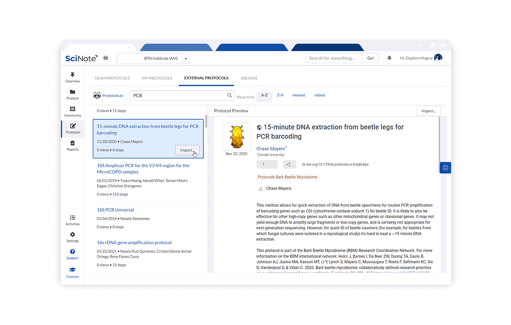
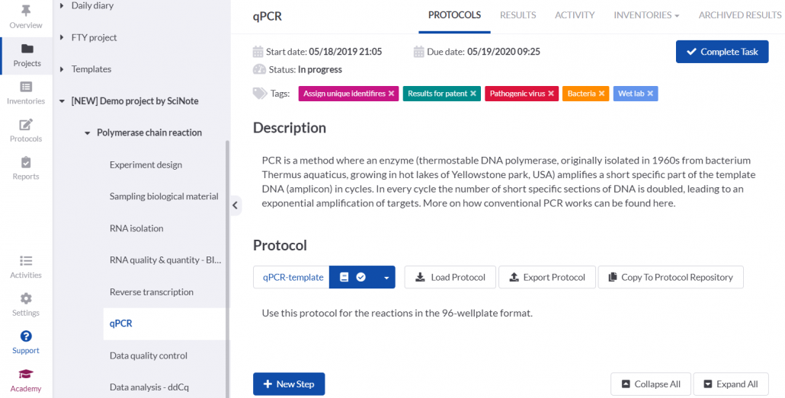
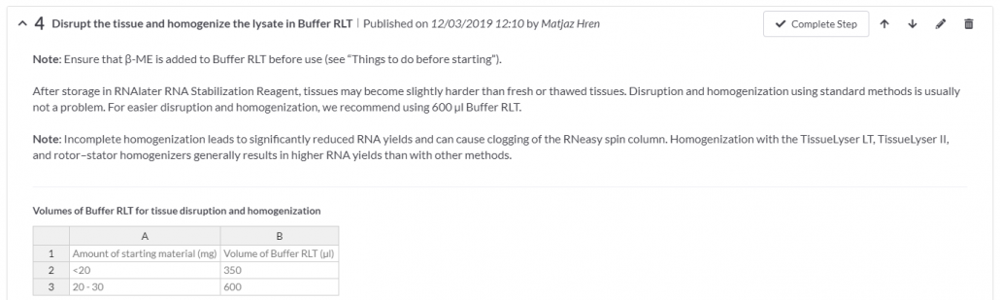
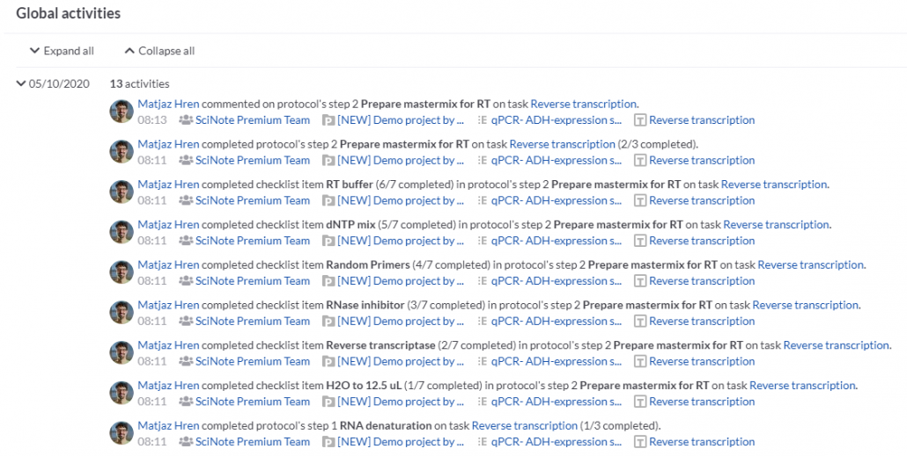
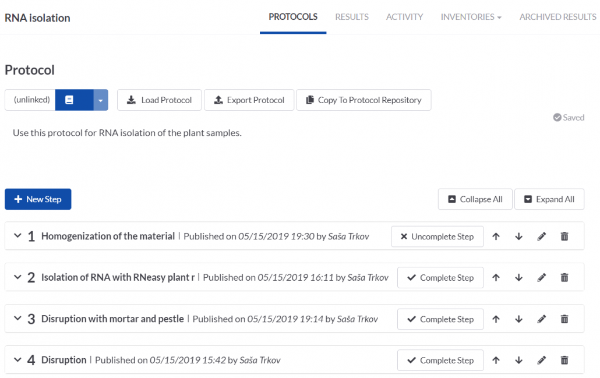
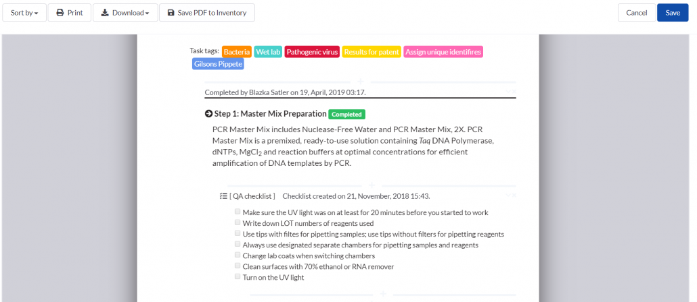

# Protocol & SOP Management（协议与标准操作规程管理）

> 官网来源：[Protocol & SOP Management for Scientific Laboratories](https://www.scinote.net/product/protocol-sop-management/)
> 配套文档：[实现现状与开发计划.md](./实现现状与开发计划.md)
> 本文档为官网特性总结（含本地图片），实现比对与缺口开发计划见配套文档。

---

## 一、概述

SciNote ELN 提供集中式的**协议（Protocol）与标准操作规程（SOP）**管理能力：在统一的协议库中组织、创建、版本化、复用协议模板，并在「项目 → 实验 → 任务」层级下直接执行协议，实现数据可追溯与可重复性。

核心定位（官网原文要点）：

- 在单一位置组织协议；创建版本；使用模板；从 protocols.io 导入公共协议。
- 以结构化、易用的方式在团队内存储与共享科学方法、操作流程、设备说明、安全规范等。

---

## 二、核心功能

### 1. 轻松组织与共享协议 / SOP

把各类科学方法、操作流程、设备说明、安全规范等以结构化的方式存储并与团队共享。

- **协议库（Protocol Repository）**：集中式数字图书馆，承载协议与 SOP。
- **我的协议（MY PROTOCOLS）**：仅自己使用。
- **团队协议（TEAM PROTOCOLS）**：与同事共享，对全团队成员可见。

### 2. 按需创建协议

编写、定制并审阅内容丰富的协议版本，支持：

- 文本、图片、表格、检查清单（checklist）、化学绘图（chemical drawings）、代码、关键词（keywords）、评论（comments）等富内容。

### 3. 用协议模板提升可重复性

- 使用 SciNote 自有协议模板，或导入 **protocols.io** 的公共协议，执行重复性实验、保障结果可重复性、节省时间。
- 从任务层级创建协议时，可逐步标记完成，并与实验数据随时关联，确保数据可追溯。
- 把任务中的协议保存回协议库，并与库中版本**链接**，从而追踪任一版本后续的变更。

### 4. 全程追踪（Keep track of everything）

- 按协议步骤逐步标记完成（mark each instruction complete）。
- 随时将协议与实验数据关联（associate protocols with experimental data）。
- 记录步骤的**完成时间**与**完成人**，了解「何时、由谁」完成步骤。

---

## 三、最佳实践与用例（Best Practices）

官网给出 8 个最佳实践用例，均为既有能力的用法示范：

1. **在协议库中创建协议（Creating protocols in the protocol repository）**
   - 从空白创建（键入 / 粘贴 Word、PDF 内容），或从 protocols.io 导入公共协议。
   - 存储位置：仅自己用 → MY PROTOCOLS；与同事共享 → TEAM PROTOCOLS。
2. **在任务层级创建协议（Creating a protocol at the task level）**
   - 在 Project → Experiment → Task 下直接编写 / 粘贴（Word、Excel、PDF）。
   - 灵活添加文本、备注、标签、图片、表格、文件、计算、化学绘图等。
   - 逐步标记完成以追踪进度；从库添加协议到任务（库版本变更会收到通知）；把任务协议保存回库并链接版本以追踪变更。
3. **从 protocols.io 导入（Importing protocols from protocols.io）**
   - 与开放获取研究协议库 protocols.io 集成；可预览搜索结果；导入时自动结构化保存。
4. **优化协议结构（Optimally structuring your protocols）**
   - 在 Protocol description 写摘要 / 前置事项；拆分复杂步骤为简单步骤；展开重复步骤；用智能注解（smart annotations）交叉引用项目 / 实验 / 任务 / 仪器 / 试剂 / 存储。
5. **打印协议用于实验台（Printing your protocols）**
   - 所有协议可打印，适配无设备 / 无网络 / 防污染场景。
6. **用 SciNote Edit 打开 / 编辑 / 保存文件（SciNote Edit 桌面应用）**
   - 安装桌面应用后，可直接用文件原生程序打开并编辑任务协议步骤 / 结果中附着的文件，保存后直写回 SciNote。
7. **良好的协议管理实践（Good protocol management practice）**
   - 协议即实验文档核心；在任务上包含试剂 / 样本 / 设备 / 计算 / 图片 / 附件 / 结果；为步骤添加备注记录偏差；协议完整纳入可打印报告。
8. **SciNote 交互式协议的优势（Interactive protocols）**
   - 相比静态 PDF / Word，SciNote 协议可交互、可执行（笔记本 / 平板 / 手机），可逐步执行、评论、关联结果 / 仪器 / 样本 / 试剂 / 用户，并保证数据完整性与可追溯。

> 注：第 6 项「SciNote Edit 桌面应用」为**外部桌面程序**（非本仓库代码），本仓仅提供「用本地程序打开文件」的接入点（见开发计划 G3）。

---

## 四、合规与报告

- 任务上的协议完整纳入 SciNote 生成的**可打印、可编辑报告**，数秒内生成（见最佳实践第 7 项）。

---

## 五、本地图片索引

| 文件名 | 对应内容 | 来源 |
|---|---|---|
| `hero-protocol-sop.jpg` | 页面主视觉 | `wp-content/uploads/2022/01/Protocol-SOP-Management-Fimg.jpg` |
| `solutions-protocol-sop.png` | MY/TEAM 协议库共享 | `wp-content/uploads/2022/06/Solutions_1100x700_Protocol_SOP.png` |
| `protocol-sop-grayback.png` | 协议 / SOP 概念图 | `wp-content/uploads/2022/06/Scinote_Protocol__SOP_grayback.png` |
| `creating-protocol-scinate.png` | 在 SciNote 创建协议 | `wp-content/uploads/2021/10/Creating-a-protocol-in-SciNote-1030x523.png` |
| `interactive-protocols.png` | 交互式协议（模板 / 导入） | `wp-content/uploads/2021/10/create-interactive-protocols-1030x309.png` |
| `global-activities.png` | 全局活动 / 追踪 | `wp-content/uploads/2021/10/SciNote-global-activites-1030x519.png` |
| `good-practice.png` | 良好协议管理实践 | `wp-content/uploads/2021/10/Good-protocol-management-practice-1030x649.png` |
| `print-protocol.png` | 打印协议 | `wp-content/uploads/2021/10/Print-your-protocol-1030x448.png` |
| `scinote-edit.png` | SciNote Edit 桌面集成示例 | `wp-content/uploads/2024/02/SciNote-Edit_Graph-Pad-Prism_Example_3-1030x375.png` |
| `untitled-2026.png` | 2026 年官网配图 | `wp-content/uploads/2026/04/Untitled-design-2-scaled-...png` |
