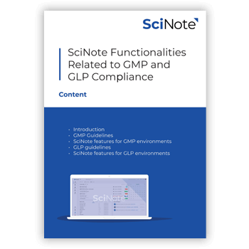
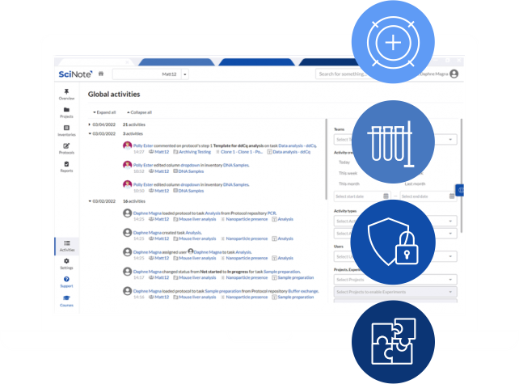
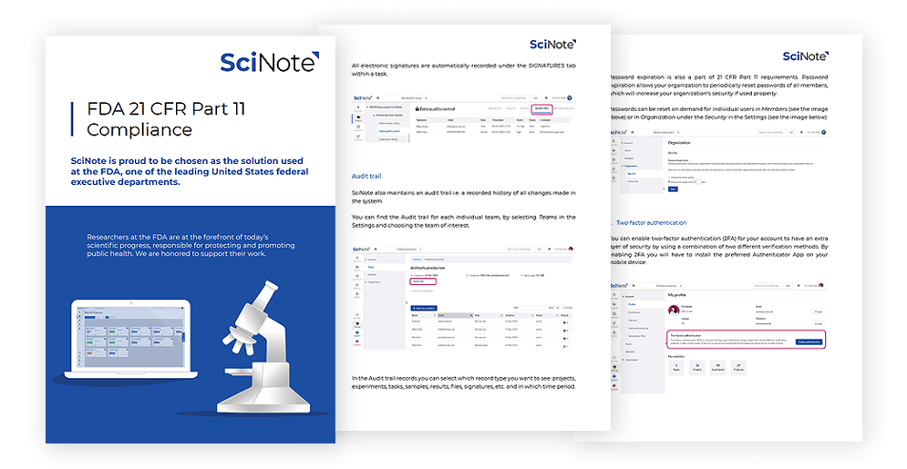
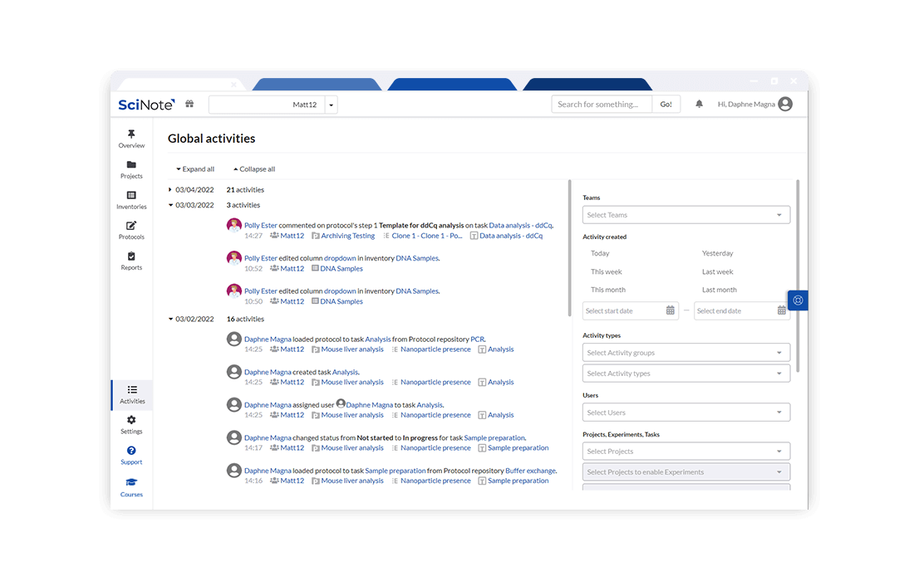

# SciNote in Regulated Environments（21 CFR Part 11 / GLP / GMP, GxP）— 特性总结

> 官网来源：[SciNote in Regulated Environments](https://www.scinote.net/product/scinote-in-regulated-environments/)
> 配套文档：[实现现状与开发计划.md](./实现现状与开发计划.md)
> 本文档为官网特性总结（含本地图片，可离线阅读），实现比对与缺口开发计划见配套文档。
> 图片已下载至本目录 `images/`，文档全部用相对路径引用。

---

## 一、概述

SciNote 面向受 FDA 21 CFR Part 11、GLP、GMP（统称 GxP）监管的实验室，把合规能力**内建进平台**，而非事后打勾。官网核心主张：当审计/检查来临时，团队不是「在准备」，而是「已就绪」。

官网给出的合规背书：

- SciNote 受 **FDA、USDA** 及 **100+ 国家 90,000+ 科学家**信任。
- **ISO 27001:2022** 认证。
- 正处于 **US FedRAMP Authorization** 流程中。

适用监管框架（官网原文）：

- **GMP – Good Manufacturing Practice**：FDA CFR Title 21 Part 11、EudraLex Volume 4（GMP Guidelines）Annex 11。
- **GLP – Good Laboratory Practice**：确保软件质量一致性、数据安全与完整性的原则。

---

## 二、21 CFR Part 11 合规能力

官网明确 SciNote 提供 21 CFR Part 11 所需的全部能力：

- **电子签名（electronic signatures）**
- **审计追踪（audit trails）**
- **时间戳（time stamps）**
- **用户角色与权限（user roles and permissions）**

在「FDA 21 CFR PART 11 COMPLIANCE」一节，官网进一步列出：

- 电子签名（electronic signatures）
- **电子见证（electronic witnessing）**
- 审计追踪（audit trails）

> 即：除签名人本人签名外，受监管流程常要求**第二人见证（witness）**同一记录，构成「签名 + 见证」双重责任链。

### 时间戳电子签名（TIME-STAMPED ELECTRONIC SIGNATURES）

官网强调：电子签名**唯一对应个人**，并与相应电子记录**不可抵赖地绑定**，以防止欺诈性使用。

---

## 三、GxP 指南对 ELN 的要求

官网提醒选型前须知（GxP GUIDELINES FOR ELNs）：

- ELN 应具备监管指南要求的技术特性。
- ELN（及任何软件/工具）本身**不能被认证为 GxP 合规**，只能支撑实验室满足要求。
- GxP 合规主要取决于组织如何尽职地落实流程与程序控制。

---

## 四、GLP 环境的 SciNote 功能清单

官网逐条列出 GLP 环境所需功能（对应本 fork 的实现比对见配套文档）：

1. 严格访问控制（唯一用户名 + 密码组合）
2. 受限的用户权限管理（分配用户角色）
3. **会话超时（session timeout）**
4. 强健的加密标准（robust encryption standards）
5. 数据每日多次备份（multiple daily backups）
6. 带时间戳的审计追踪（用于变更控制，不可编辑/删除）
7. 带时间戳的电子签名
8. 全量电子数据以人类可读格式导出
9. 数据归档（保持原始数据结构、严格访问、权限控制、可快速检索）
10. 软件验证（含测试与整体性能评估，IQ/OQ）

### GMP 环境的 SciNote 功能（节选）

- 封闭系统（closed system）、受限访问，靠唯一登录保障。
- 随时可生成人类可读的数据副本；全量导出保留附件目录结构。
- 带时间戳的审计追踪，独立记录每个用户的录入与操作时间，**不可编辑或删除**。

---

## 五、Premium 计划与 21 CFR Part 11 插件

官网说明：SciNote **Premium 计划（Essential / Validated / Platinum）**包含 **21 CFR Part 11 插件（add-on）**，在保持灵活易用的同时提供合规工具集。

> 本 fork 已将该「21 CFR Part 11 插件」以独立 Rails Engine addon（`esignatures`）形式实现（见 ADR-007）。

---

## 六、合规评价与边界

- **可落地为代码的能力**（电子签名、审计追踪、时间戳、角色权限、会话超时、全量导出、归档、加密/2FA/SSO）：本 fork 已有相当覆盖，详见配套文档的实现矩阵。
- **基础设施 / SaaS 服务类能力**（每日多次备份、FedRAMP、ISO 27001 认证、软件验证 IQ/OQ、CSM 用户上手）：属运维/合规声明，不在 web fork 代码范围内，文档中标注为 N/A。

---

## 七、本地图片索引

| 文件名 | 语义 | 来源 |
|---|---|---|
| `SciNote-in-regulated-GxP-environments-Fimg.jpg` | 受监管 GxP 环境主视觉（hero） | wp-content/uploads/2022/01 |
| `Scinote_21_CFR_pt_11_grayback-1.png` | 21 CFR Part 11 合规说明图 | wp-content/uploads/2022/06 |
| `Solutions_1100x700_21_CFR.png` | 21 CFR 解决方案示意图 | wp-content/uploads/2022/06 |
| `SciNote_icon4_GMP_GLP_Complience-copy-1.png` | GMP/GLP 合规图标 | wp-content/uploads/2022/08 |
| `Fda_21_kolaz_transparent_ozadje-1.png` | FDA 21 CFR 拼贴图 | wp-content/uploads/2022/11 |
| `Untitled-design-2-scaled-e1776071070803-258x300.png` | 近期合规横幅（2026-04） | wp-content/uploads/2026/04 |

> 已剔除：社交图标（Facebook/LinkedIn/ResearchGate/Twitter/YouTube SVG）与站点 favicon 等无关图。
