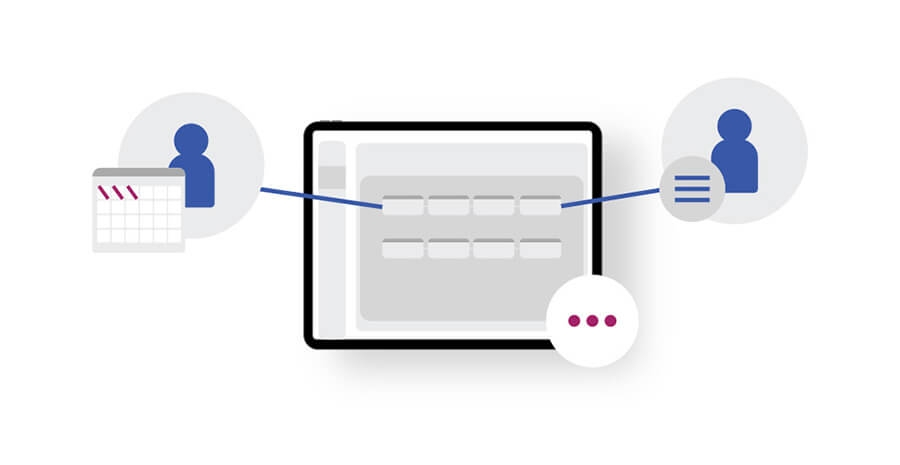
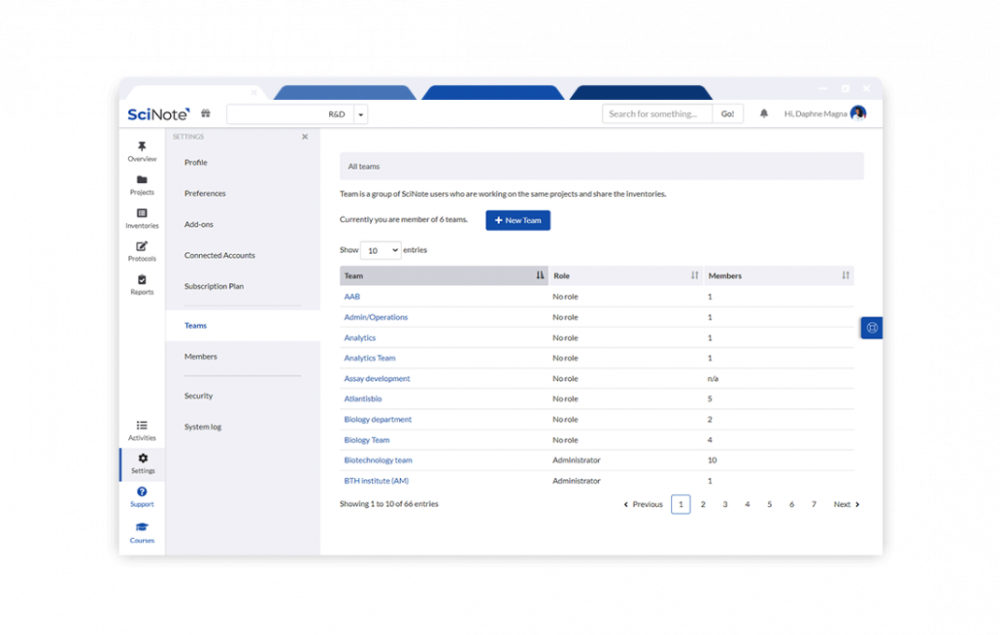
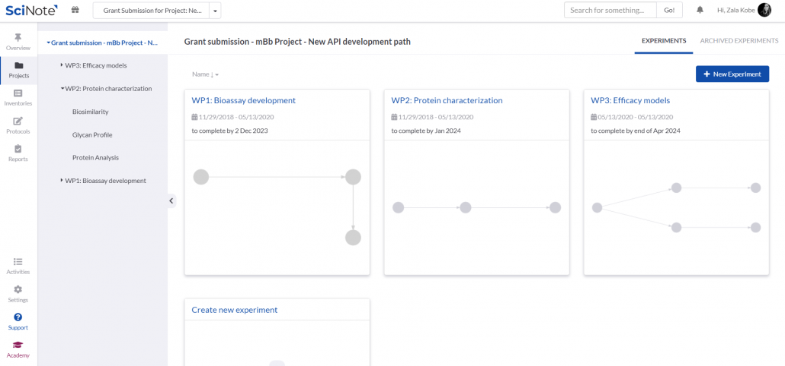
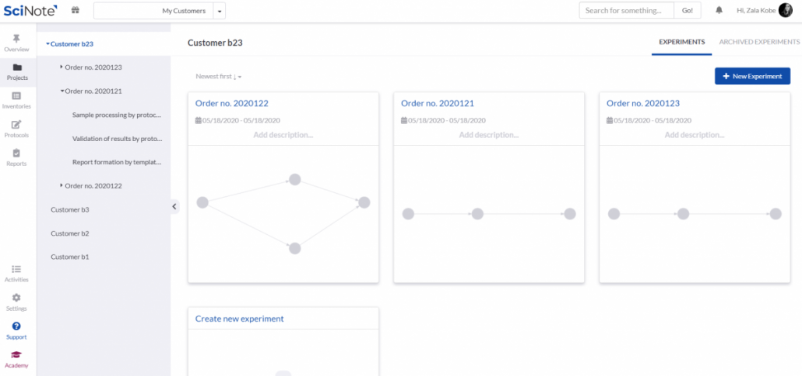
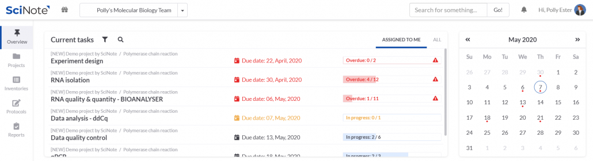
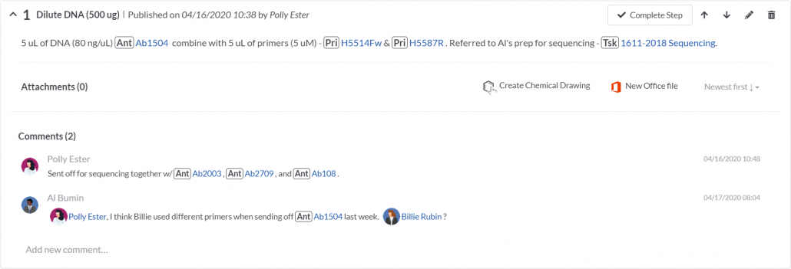

# Team Management（协作与团队管理）— 官网特性总结

> 来源页面：<https://www.scinote.net/product/team-management/>
> 抓取时间：2026-09-01
> 配套文档：[实现现状与开发计划.md](./实现现状与开发计划.md)（含 addon 形态缺口与 ADR-011）

本页面向科学实验室，介绍 SciNote 的协作与团队管理能力。核心是**在何处、由谁、以何种权限**访问实验数据，以及围绕团队结构的协作、分配、沟通、审计与对外报告。

---

## 一、概述

SciNote 让团队、外部合作伙伴与承包商能够随时随地高效沟通与协作。页面把 Team Management 拆成 6 大可使用的能力，并辅以若干行业用例（跨地域协作、拨款提案共建、客户项目隔离审计、团队数字化入门）。

---

## 二、核心功能

### A. 创建团队并自定义用户角色与权限

- 每个人必须被授予访问权，获得唯一用户名/密码用于每次身份验证。
- 可创建团队，并按需**细分子团队、仅批准访问 ELN 的某些部分**（此能力取决于 SciNote 计划）。
- 在单个项目内设置数据可见性，仅选定人员可参与项目。
- 外部协作者可受邀查看选定记录，角色层级 + 细粒度权限提供快速方案。
- 离职人员可限制访问：从项目移除并阻止其再次登录（User management）。

### B. 在数据所在处协作并交叉引用

- 用 `#` 链接样本数据 / 任意相关数据；用 `@` 标记团队成员进行通知、提问、委派工作。
- 可添加指向 SciNote 外部信息的超链接。

### C. 改善跨团队沟通与协作

- 委派任务 → 显示在成员的 **Overview** 标签页与**日历**中。
- **报告**功能把数据整理成可呈现给同事的整洁形式（简报/详报）。
- **电子签名**审批实验室记录。
- `@` 即时讨论；选择时区后 SciNote 自动转换所有时间戳。

### D. 与合作伙伴共建拨款提案

- 用 Projects / Experiments / Tasks 层级规划、撰写、存储提案材料。
- 用库存系统组织附件；用任务截止日期/状态跟踪进度、设提醒。
- 用报告生成器拉取结构化草稿。

### E. 简化外部伙伴与客户报告及计费

- 共享选定内部记录（自定义查看/编辑权限）。
- 跟踪订单与交付物进度，形成清晰责任边界。
- 生成结构化报告（开放/关闭编辑格式共享）。
- 经 **RESTful API** 集成 CRM/ERP，定期或按需生成账单快照，自动化会计。

### F. 借助 SciNote 资源快速让团队上手

- Premium 计划含持续客户支持、个性化入门、基于用例的培训（定义最佳方法 / 选择内部 ELN 专家 / 完全个性化 onboarding / 用例学习）。
- 自学资源：SciNote Academy、YouTube 教程、知识库、LinkedIn 社区。

---

## 三、角色与用例

| 角色 | 在本页的诉求 |
|---|---|
| 团队成员 / 普通用户 | 被分配任务、被 @ 标记、参与项目、可创建团队（依权限） |
| 外部合作者 / 合作伙伴 / 承包商 | 受邀查看/编辑选定记录，参与拨款与客户项目 |
| 客户 | 接收报告、审计专用空间、以任务交付物形式接收订单 |
| 用户/组织管理员（PI / Lab Admin） | 创建团队、细分权限、移除成员、限制登录 |
| 科学家 / 研究员 | 一线实验与协作 |
| 高管（President / CSO） | 评估并选择满足隔离审计需求的系统 |
| 任务负责人 / 责任团队 | 任务截止日期与提醒对象 |
| SciNote 支持 / 客户成功 | onboarding、培训与资源 |

**典型用例**：① 跨地域团队用 @ / # / 任务 / 电子签名 / 时区同步保持同步；② 实验室建多团队、细分 ELN 访问区、外部承包商仅见特定项目、离职即禁用账户；③ 与伙伴在 SciNote 内共建拨款提案；④ 为客户建独立笔记本隔离审计、订单作任务跟踪、API 自动化计费；⑤ Premium 定制上门培训。

---

## 四、合规与评价

- 页面上下文支持 21 CFR Part 11 电子签名用于审查批准（本 fork 已由 `addons/esignatures` 实现，见 ADR-007）。
- 客户审计权：为每客户保留专用、自包含笔记本以便审计（见用例引用 Advanced Cellular Dynamics）。
- 用户评价：Numaferm（Dr. Jannik Strauss）称平台助力直接沟通与信息中继；Advanced Cellular Dynamics（Deborah Schwarz）强调为客户隔离笔记本以满足审计。

---

## 五、本地图片索引

| 文件 | 语义 |
|---|---|
| `images/Team-management-and-collaboration-Fimg.jpg` | Hero 图 |
| `images/Solutions_1100x700_Team_management-1030x655.png` | 团队管理主要功能图 |
| `images/Working-on-grants-1030x482.png` | 拨款提案协作 |
| `images/Collaborate-with-external-partners-and-customers-1030x485.png` | 外部伙伴/客户协作 |
| `images/collaboration-with-partners-1030x281.png` | 伙伴协作横幅 |
| `images/partner-collaboration-1030x351.png` | 伙伴协作示意 |

> 已剔除：社媒 SVG 图标、作者头像（Deborah / Jannik）、站点 favicon、无关装饰图。
