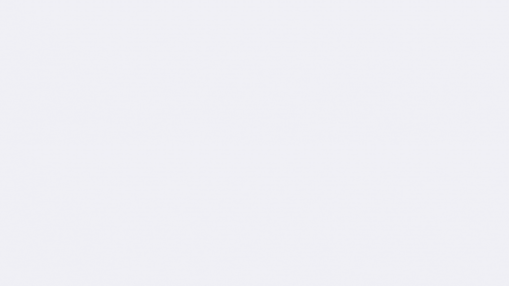
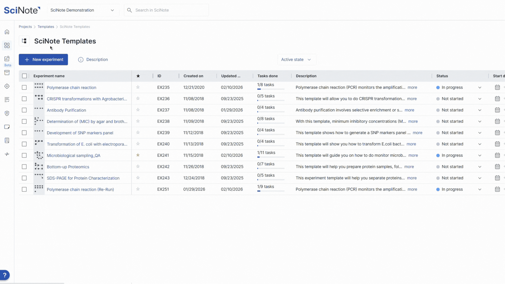
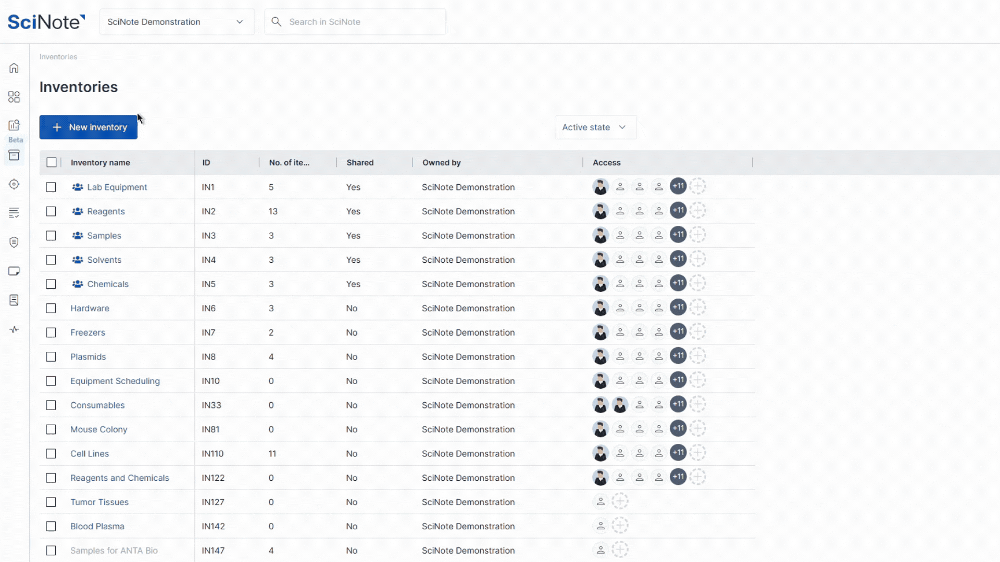
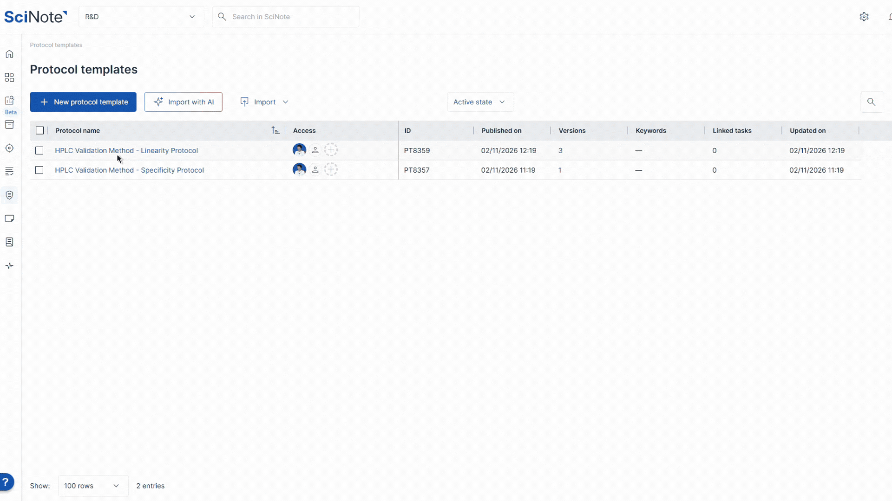
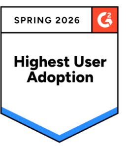

# SciNote Templates（模板）— 特性总结

> 官网来源：[SciNote Templates — Standardize your lab workflows](https://www.scinote.net/product/scinote-templates/)
> 配套文档：[实现现状与开发计划.md](./实现现状与开发计划.md)
> 本文档为官网特性总结（含本地图片），实现比对与缺口开发计划见配套文档。

---

## 一、概述

SciNote Templates 帮助生物制药、生物技术、诊断与医疗器械企业**减少变异、强制执行 SOP 合规、为审计 / 自动化 / AI 准备结构化数据**。

Templates 覆盖从实验设计、协议定义、数据捕获到报告输出的**整条实验室工作流**，提供多种可复用的模板类型，使团队在重复研究中保持文档统一、字段一致、可追溯。

核心定位（官网原文要点）：

- 为受监管实验室提供贯穿「实验设计 → 协议定义 → 数据捕获 → 报告」的标准化模板。
- 通过对变量、字段、库存项的预定义，降低人为误差、强化 SOP 合规、支撑审计就绪。
- 结构化数据可直接用于 AI 建模与模拟，并支持 GxP / ISO / 21 CFR Part 11 等合规框架。

---

## 二、可用的模板类型

官网将 SciNote 模板划分为六大类：

### 1. 实验与工作流模板（Experiment and Workflow Templates）

> "Structure what variables need to be captured every time."（结构化每次都需捕获的变量）

- 为可重复研究确保统一文档。
- 预定义类别：培养条件（incubation conditions）、样本类型（sample types）、时间点（timepoints）。
- 适合多用户团队与高通量工作流。

**用例（Used for）**：抗体开发、PCR 优化、QC 方法、设备材料测试。

### 2. 协议模板 / SOP（Protocol Templates (SOPs)）

> "Digitally define every step of your lab's procedures."（数字化定义实验室每一步操作）

- 版本受控、角色受限（role-restricted）的 SOP。
- 支撑合规：GLP、GCP、ISO 13485 等。
- 含必填输入字段与检查清单（checklists）。
- 可选「物料模板（Item Templates）」锁定必需的库存项（NEW）。

**用例（Used for）**：诊断检测 SOP、细胞培养、生物相容性测试、灭菌验证。

### 3. SciNote Forms（表单）

> "Bring structure, validation, and real-time traceability to every line of lab data."（为每一行实验数据带来结构、校验与实时可追溯）

- 用结构化字段类型（文本、下拉、数值）设计可复用数字表单。
- 可嵌入协议步骤（protocol steps），或独立用于批量处理、检验与 QA。
- 内置审计追踪（audit trails）、版本控制（versioning）、字段校验（field validation）与元数据导出。

**用例（Used for）**：批记录（batch records）、技术员检查清单、样本接收表、验证日志、研究摘要。

### 4. 物料模板（Item Templates）

> "Predefine the exact inventory items needed for a specific protocol."（为特定协议预定义所需的精确库存项）

- 自动提示用户使用正确的预批准试剂、仪器、试剂盒（reagents / instruments / kits）。
- 通过批次与物料强制合规（enforces compliance by batch and material）。
- 防止错误、漏填输入与批号不一致。

**用例（Used for）**：GxP 检测验证、诊断试剂盒组装、仪器专用协议。

### 5. 结果模板（Result Templates）

> "Capture output data that's consistent and exportable."（捕获一致且可导出的输出数据）

- 定义字段（如 Ct 值、得率、纯度百分比）。
- 支撑 AI 建模与外部审阅格式。
- 数据以 CSV / JSON 导出就绪（export-ready）。

**用例（Used for）**：ELISA、qPCR、剂量响应、稳定性测试、AI 预测模型。

### 6. 库存模板（Inventory Templates）

> "Log every reagent, device, or sample with full traceability."（记录每个试剂、设备或样本并完整追溯）

- 标准化样本 ID、批号、存储、有效期（expiration）的捕获方式。
- 将库存直接关联到实验与结果。
- 契合审计与监管链（chain-of-custody）要求。

---

## 三、受监管行业如何使用 Templates 与 Forms

官网强调 Templates + Forms 在受监管场景下的落地：

| 行业 | 用法 |
|---|---|
| **生物制药 / 制药** | IND/BLA 就绪的协议与结果捕获；带关联审计追踪的批次 QC 报告；GxP 库存与批号使用模板 |
| **生物技术 / CRO** | 靶点验证、CRISPR、AI 建模研究模板；带可追溯 SOP 的早期 R&D 协议；用于发表与数据科学的干净元数据生成 |
| **诊断** | 映射到 Forms 的 SOP 流程（ISO 15189 / CLIA）；技术员录入表单与批次检测追踪；用 Forms 结构化的试剂盒记录（批号、患者 ID、结果类型等字段） |
| **医疗器械** | 校准表单与材料测试模板；逐步记录测试方法验证；支撑设计历史文件（DHF）文档 |

**Real Labs, Real Forms（真实落地示例）**：

- 临床实验室用 Forms 数字化 CLIA 检查所需的必填字段。
- 设备团队通过预设 Forms 追踪每台设备的校准。
- 生物制药用 Forms 将早期发现的移交点与下游 QA 绑定。

---

## 四、合规与价值主张

> "SciNote Templates support GxP, ISO, and 21 CFR Part 11 compliance, improve audit readiness through better documentation, enable repeatable workflows that reduce errors, and create structured data ready for AI and simulation."

- 减少变异性（reduce variability）。
- 强制执行 SOP 合规（enforce SOP compliance）。
- 改进审计准备（audit readiness）。
- 可重复工作流减少错误。
- 结构化数据用于 AI 与模拟。

---

## 五、本地图片索引

| 文件名 | 对应内容 | 来源 |
|---|---|---|
| `SciNote-Templates-1.gif` | 页面主视觉 | `wp-content/uploads/2026/02/SciNote-Templates-1.gif` |
| `Workflow-Experiments-Templates.gif` | 实验 / 工作流模板 | `wp-content/uploads/2026/02/Workflow-Experiments-Templates.gif` |
| `Protocol-Templates-Results-Items-1.gif` | 协议 / 结果 / 物料模板 | `wp-content/uploads/2026/02/Protocol-Templates-Results-Items-1.gif` |
| `Untitled-design.gif` | SciNote Forms 表单 | `wp-content/uploads/2026/02/Untitled-design.gif` |
| `Untitled-design-2-scaled-e1776071070803-258x300.png` | 2026 合规 / 价值主张配图 | `wp-content/uploads/2026/04/Untitled-design-2-scaled-e1776071070803-258x300.png` |
| `Biopharma-80x80.png` | 生物制药行业图标 | `wp-content/uploads/2026/02/Biopharma-80x80.png` |
| `Biotech-80x80.png` | 生物技术行业图标 | `wp-content/uploads/2026/02/Biotech-80x80.png` |
| `Diagnostics-80x80.png` | 诊断行业图标 | `wp-content/uploads/2026/02/Diagnostics-80x80.png` |
| `Medical-Devices-80x80.png` | 医疗器械行业图标 | `wp-content/uploads/2026/02/Medical-Devices-80x80.png` |
